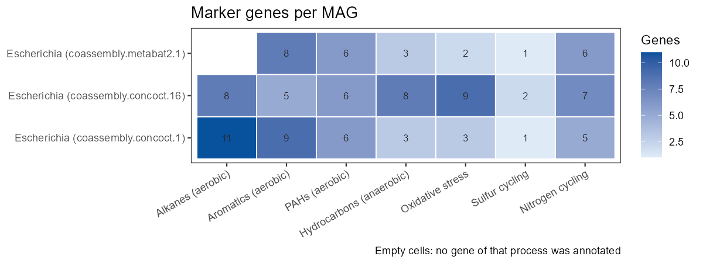

# magreport

<!-- badges: start -->
[](https://github.com/AntonioPuriel/magreport/actions/workflows/R-CMD-check.yaml)
<!-- badges: end -->

R package to explore and report MAG recovery results from
[mag-pipeline](https://github.com/AntonioPuriel/mag-pipeline).

The pipeline writes plain tables; `magreport` reads them into tidy data frames
with the right types, so you can go straight to analysis and figures.


## Installation

```r
# install.packages("remotes")
remotes::install_github("AntonioPuriel/magreport")
```

## Usage

```r
library(magreport)

results <- "path/to/mag-pipeline/results"

mags    <- read_mag_quality(file.path(results, "05_quality/mag_quality.tsv"))
bins    <- read_bin_summary(file.path(results, "04_binning/bin_summary.tsv"))
mapping <- read_mapping_summary(file.path(results, "03_mapping/mapping_summary.tsv"))
depth   <- read_depth(file.path(results, "03_mapping/coassembly.depth.txt"))

count_quality(mags, by = "binner")

# Everything at once, plus an HTML report
run <- read_pipeline(results)
mag_report(results, "mag_report.html")

plot_mag_quality(mags, facet_by = "binner")
plot_mapping_rates(mapping)
plot_taxonomy(mags, rank = "phylum", fill_by = "quality")
```

The plotting functions need ggplot2, which is a suggested dependency:
`install.packages("ggplot2")`.

Every function ships an example that runs on the output included in the package,
so you can try it without your own data:

```r
path <- system.file("extdata", "example_run", "mag_quality.tsv", package = "magreport")
head(read_mag_quality(path))
```

## Functions

| Function | Reads |
|----------|-------|
| `read_mag_quality()` | `05_quality/mag_quality.tsv` (quality and taxonomy per MAG) |
| `read_bin_summary()` | `04_binning/bin_summary.tsv` (size, N50 and GC per bin) |
| `read_mapping_summary()` | `03_mapping/mapping_summary.tsv` (alignment rate per sample) |
| `read_depth()` | `03_mapping/*.depth.txt` (contig coverage per sample) |
| `read_ko_table()` | `07_function/ko_per_mag.tsv` (KEGG orthologues per MAG) |
| `read_annotation_stats()` | `07_function/annotation_stats.tsv` (annotated fraction per MAG) |
| `count_quality()` | Counts MAGs per MIMAG quality category |
| `read_pipeline()` | Finds and reads every table of a run in one call |
| `mag_report()` | Renders a full HTML report of a run |

## Plots

All figures below come from the example output shipped with the package, and are
regenerated with `data-raw/make_readme_figures.R`.

### `plot_mag_quality()`

Completeness against contamination, with the MIMAG thresholds and the
high-quality corner shaded. Point size is the size of the MAG.


### `plot_mapping_rates()`

Share of reads of each sample that map back to the assembly. Samples below the
threshold are highlighted, since their coverage is less trustworthy.


### `plot_taxonomy()`

MAGs per taxon at any rank. Unclassified MAGs are kept as their own group
instead of being dropped.


## Marker genes

`plot_pathway_presence()` crosses the KEGG orthologues of each MAG with a set of
marker genes and answers the question that follows MAG recovery in a polluted
site: which genomes can do what. The package ships `hydrocarbon_kos()`, a curated
set covering aerobic alkane, aromatic and PAH degradation, anaerobic degradation
through fumarate addition and the benzoyl-CoA route, oxidative stress, and sulfur
and nitrogen cycling as environmental context. Any data frame with `pathway` and
`ko` columns can be used instead.

### `plot_pathway_presence()`



## Report

`mag_report()` takes a results directory and writes a self-contained HTML report
with the mapping, assembly, binning, MAG quality and taxonomy sections. Sections
without data are skipped with a note, so a run without GTDB-Tk or CheckM2 still
produces a valid report.

## Documentation

Full function reference: <https://antoniopuriel.github.io/magreport/>

## License

MIT
